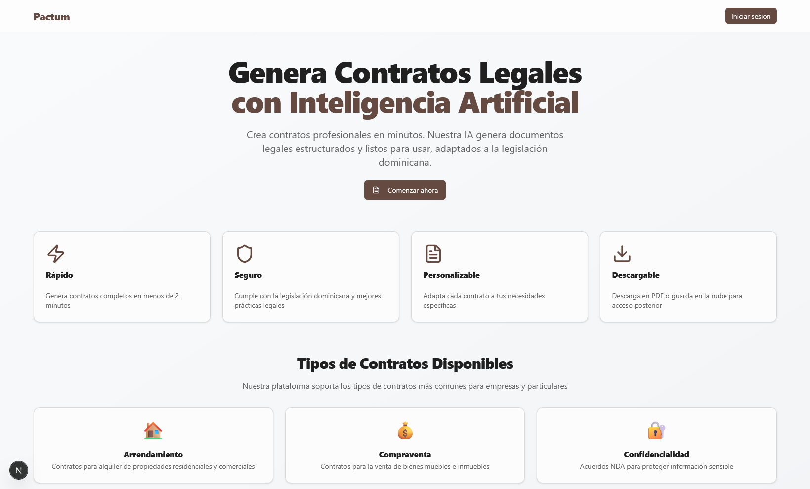

# Contract Generator - Generador de Contratos con IA

🚀 Generador de Contratos Automáticos con IA

Aplicación web desarrollada con Next.js que permite generar contratos legales personalizados (como arrendamiento, compraventa o NDA) mediante preguntas clave y procesamiento con inteligencia artificial (Groq AI).

Los usuarios seleccionan el tipo de contrato, completan un formulario dinámico y obtienen el contrato listo para vista previa, descarga en PDF o almacenamiento con UploadThing.

🔧 Tecnologías utilizadas: Next.js, TypeScript, Tailwind CSS, ShadCN, Groq AI, react-hook-form, Zod, AI SDK, pdf-lib.

## 🚀 Características

- **Generación Automática**: Crea contratos completos usando IA
- **Múltiples Tipos**: Soporta arrendamiento, compraventa, NDA y más
- **Interfaz Intuitiva**: Flujo guiado paso a paso
- **Formularios Dinámicos**: Campos adaptativos según el tipo de contrato
- **Vista Previa**: Revisa el contrato antes de descargarlo
- **Exportación PDF**: Genera PDFs profesionales
- **Almacenamiento**: Integración con Cloudflare R2 para guardar contratos

## 🛠️ Tecnologías

- **Frontend**: Next (App Router), TypeScript, Tailwind CSS
- **UI Components**: Shadcn/ui, Radix UI
- **Formularios**: React Hook Form + Zod
- **IA**: Groq AI
- **PDF**: pdf-lib
- **Almacenamiento**: Cloudflare R2
- **Validación**: Zod schemas

## 📝 Uso

1. **Seleccionar Tipo de Contrato**: Elige entre los tipos disponibles
2. **Completar Formulario**: Llena los campos requeridos
3. **Generar Contrato**: La IA creará el documento
4. **Revisar y Descargar**: Vista previa y descarga en PDF
5. **Guardar (Opcional)**: Almacenar en la nube

## 🎯 Tipos de Contratos Soportados

- **Arrendamiento**: Contratos de alquiler residencial/comercial
- **Compraventa**: Venta de bienes muebles e inmuebles
- **NDA**: Acuerdos de confidencialidad
- **Servicios**: Contratos de prestación de servicios (próximamente)
- **Empleo**: Contratos laborales (próximamente)
- **Préstamo**: Contratos de préstamo (próximamente)

## 🤖 Integración con IA

La aplicación utiliza Claude de Anthropic para generar contratos. Los prompts están optimizados para:

- Generar contenido legal apropiado para República Dominicana
- Incluir todas las cláusulas necesarias
- Usar terminología jurídica correcta
- Estructurar el documento profesionalmente

## 📄 Generación de PDF

Características del generador de PDF:

- Formato A4 profesional
- Fuentes legibles (Helvetica)
- Numeración de páginas automática
- Manejo de texto largo con saltos de página
- Headers y footers personalizables

## 🔒 Consideraciones Legales

⚠️ **Importante**: Los contratos generados son plantillas automatizadas y deben ser revisados por un profesional legal antes de su uso oficial. Esta aplicación no constituye asesoría legal.
