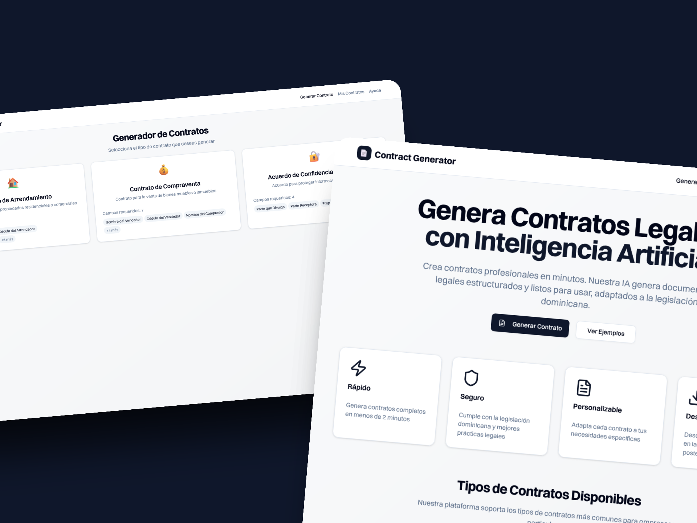
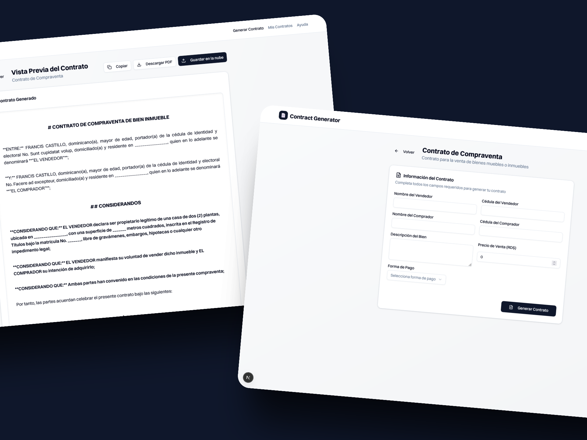
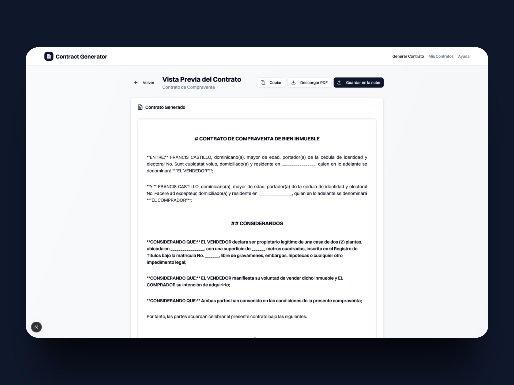

# Contract Generator - Generador de Contratos con IA

🚀 Generador de Contratos Automáticos con IA

Aplicación web desarrollada con Next.js que permite generar contratos legales personalizados (como arrendamiento, compraventa o NDA) mediante preguntas clave y procesamiento con inteligencia artificial (Claude o GPT-4).

Los usuarios seleccionan el tipo de contrato, completan un formulario dinámico y obtienen el contrato listo para vista previa, descarga en PDF o almacenamiento con UploadThing.

🔧 Tecnologías utilizadas: Next.js, TypeScript, Tailwind CSS, ShadCN, UploadThing, react-hook-form, Zod, AI SDK, pdf-lib.

🛠️ En desarrollo - MVP sin firma electrónica, pero preparado para escalar.

## 🚀 Características

- **Generación Automática**: Crea contratos completos usando IA
- **Múltiples Tipos**: Soporta arrendamiento, compraventa, NDA y más
- **Interfaz Intuitiva**: Flujo guiado paso a paso
- **Formularios Dinámicos**: Campos adaptativos según el tipo de contrato
- **Vista Previa**: Revisa el contrato antes de descargarlo
- **Exportación PDF**: Genera PDFs profesionales
- **Almacenamiento**: Integración con UploadThing para guardar contratos

## 🛠️ Tecnologías

- **Frontend**: Next.js 14 (App Router), TypeScript, Tailwind CSS
- **UI Components**: Shadcn/ui, Radix UI
- **Formularios**: React Hook Form + Zod
- **IA**: Claude (Anthropic API)
- **PDF**: pdf-lib
- **Almacenamiento**: UploadThing
- **Validación**: Zod schemas

## 📦 Instalación

1. **Clonar el repositorio**

```bash
git clone <repository-url>
cd contract-generator
```

2. **Instalar dependencias**

```bash
npm install
```

3. **Configurar variables de entorno**

```bash
cp .env.local.example .env.local
```

Edita `.env.local` con tus credenciales:

```env
ANTHROPIC_API_KEY=tu_clave_de_anthropic
UPLOADTHING_SECRET=tu_secret_de_uploadthing
UPLOADTHING_APP_ID=tu_app_id_de_uploadthing
NEXT_PUBLIC_APP_URL=http://localhost:3000
```

4. **Ejecutar en desarrollo**

```bash
npm run dev
```

## 🔧 Configuración

### API Keys Requeridas

1. **Anthropic API Key**: Obtén una clave en [console.anthropic.com](https://console.anthropic.com)
2. **UploadThing**: Registrarte en [uploadthing.com](https://uploadthing.com) para obtener las credenciales

### Estructura del Proyecto

```
src/
├── app/                    # App Router de Next.js
│   ├── api/               # API Routes
│   ├── contracts/         # Páginas de contratos
│   └── globals.css        # Estilos globales
├── components/            # Componentes React
│   ├── ui/               # Componentes de UI base
│   └── contract/         # Componentes específicos de contratos
├── lib/                  # Utilidades y configuraciones
│   ├── ai/              # Integración con Claude
│   ├── contracts/       # Templates y schemas
│   ├── pdf/             # Generación de PDFs
│   └── upload/          # Configuración de UploadThing
├── types/               # Definiciones de tipos TypeScript
└── hooks/               # Custom React hooks
```

## 📝 Uso

1. **Seleccionar Tipo de Contrato**: Elige entre los tipos disponibles
2. **Completar Formulario**: Llena los campos requeridos
3. **Generar Contrato**: La IA creará el documento
4. **Revisar y Descargar**: Vista previa y descarga en PDF
5. **Guardar (Opcional)**: Almacenar en la nube

## 🎯 Tipos de Contratos Soportados

- **Arrendamiento**: Contratos de alquiler residencial/comercial
- **Compraventa**: Venta de bienes muebles e inmuebles
- **NDA**: Acuerdos de confidencialidad
- **Servicios**: Contratos de prestación de servicios (próximamente)
- **Empleo**: Contratos laborales (próximamente)
- **Préstamo**: Contratos de préstamo (próximamente)

## 🤖 Integración con IA

La aplicación utiliza Claude de Anthropic para generar contratos. Los prompts están optimizados para:

- Generar contenido legal apropiado para República Dominicana
- Incluir todas las cláusulas necesarias
- Usar terminología jurídica correcta
- Estructurar el documento profesionalmente

## 📄 Generación de PDF

Características del generador de PDF:

- Formato A4 profesional
- Fuentes legibles (Helvetica)
- Numeración de páginas automática
- Manejo de texto largo con saltos de página
- Headers y footers personalizables

## 🔒 Consideraciones Legales

⚠️ **Importante**: Los contratos generados son plantillas automatizadas y deben ser revisados por un profesional legal antes de su uso oficial. Esta aplicación no constituye asesoría legal.

## 🛡️ Validación y Seguridad

- Validación de entrada con Zod schemas
- Sanitización de datos
- Manejo seguro de archivos
- Rate limiting en APIs (recomendado para producción)

## 🚀 Deployment

### Vercel (Recomendado)

1. Conecta tu repositorio a Vercel
2. Configura las variables de entorno
3. Deploy automático

### Docker

```bash
# Construir imagen
docker build -t contract-generator .

# Ejecutar contenedor
docker run -p 3000:3000 --env-file .env.local contract-generator
```

## 🤝 Contribuir

1. Fork el proyecto
2. Crea una rama para tu feature (`git checkout -b feature/nueva-funcionalidad`)
3. Commit tus cambios (`git commit -m 'Agregar nueva funcionalidad'`)
4. Push a la rama (`git push origin feature/nueva-funcionalidad`)
5. Abre un Pull Request

## 📋 TODO

- [ ] Autenticación de usuarios
- [ ] Base de datos para historial de contratos
- [ ] Más tipos de contratos
- [ ] Firma electrónica
- [ ] Plantillas personalizables
- [ ] API pública
- [ ] Modo multi-idioma
- [ ] Integración con servicios legales

## 📞 Soporte

Para reportar bugs o solicitar funcionalidades, abre un issue en el repositorio.

## 📄 Licencia

Este proyecto está bajo la licencia MIT. Ver el archivo `LICENSE` para más detalles.
